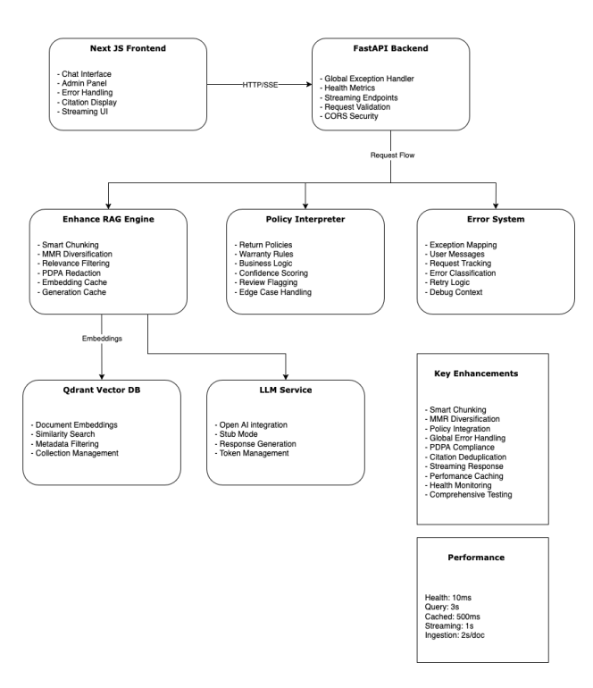

# AI Policy & Product Helper

A RAG system with **FastAPI** backend, **Next.js** frontend, and **Qdrant** vector database. Features intelligent error handling, policy-aware responses, smart chunking, and comprehensive observability.

## Quick Start

```bash
# 1. Configure environment
cp .env.example .env
# Edit .env with your OpenAI API key (optional - works offline without it)

# 2. Start all services
docker compose up --build

# 3. Access the application
# Frontend: http://localhost:3000
# Backend API: http://localhost:8000/docs
# Qdrant UI: http://localhost:6333
```

## Architecture Overview

### System Components



### Enhanced RAG Pipeline

```
Document Ingestion → Smart Chunking → Embedding → Vector Storage
                                                        ↓
User Query → Context Retrieval → LLM Generation → Policy Enhancement → Response
     ↓              ↓                    ↓              ↓
Validation    MMR Diversity      PDPA Redaction   Business Rules
```

## New Enhancements

### 1. Intelligent Error Handling System

- **Global Exception Handler**: Catches all unhandled errors with structured responses
- **User-Friendly Messages**: Converts technical errors to actionable user guidance
- **Error Classification**: Authentication, rate limits, timeouts, validation errors
- **Request Tracking**: Unique request IDs for debugging and support

### 2. Smart Chunking & Retrieval

- **Semantic-Aware Chunking**: Preserves sentence and paragraph boundaries
- **Hybrid Splitting Strategy**: Sentences → Paragraphs → Clause-level for large content
- **MMR Diversification**: Maximal Marginal Relevance for diverse, relevant results
- **Relevance Filtering**: Configurable score thresholds to reduce noise

### 3. Policy Aware Response System

- **Business Logic Integration**: Return policies, warranty rules, edge cases
- **Structured Analysis**: Product type, damage classification, timeframe validation
- **Confidence Scoring**: System confidence in policy recommendations
- **Human Review Flagging**: Automatic escalation for complex cases

### 4. Privacy & Compliance

- **PDPA Redaction**: Automatic masking of emails, phone numbers, IDs
- **Sensitive Data Protection**: Configurable redaction patterns
- **Audit Trail**: Request tracking for compliance reporting

### 5. Enhanced User Experience

- **Citation Deduplication**: Clean, non-repetitive source display
- **Chunk Aggregation**: Multi-source evidence with source counting
- **Streaming Responses**: Real-time answer generation (SSE)
- **Comprehensive Error UX**: Clear error titles, messages, and suggestions

### 6. Operational Excellence

- **Health Checks**: Configuration validation and service status
- **Performance Metrics**: Latency tracking, cache hit rates, system stats
- **Feedback System**: User satisfaction tracking with SQLite persistence
- **Comprehensive Testing**: Unit, integration, and end-to-end test coverage

## Architecture Decisions & Trade-offs

### Smart Chunking Strategy

**Decision**: Hybrid sentence/paragraph/clause-based chunking

- **Pros**: Preserves semantic meaning, better retrieval quality
- **Cons**: More complex than fixed-size chunking, slight performance overhead
- **Alternative Considered**: Fixed 512-token chunks (simpler but loses context)

### MMR Diversification

**Decision**: Implement Maximal Marginal Relevance for result diversity

- **Pros**: Reduces redundant results, improves answer quality
- **Cons**: Additional computation, more complex than pure similarity
- **Alternative Considered**: Pure similarity ranking (faster but more redundant)

### Policy Integration Approach

**Decision**: Separate PolicyInterpreter class with structured analysis

- **Pros**: Clear separation of concerns, testable business logic, maintainable
- **Cons**: Additional complexity, potential for logic duplication
- **Alternative Considered**: Prompt engineering only (simpler but less reliable)

### Error Handling Strategy

**Decision**: Global exception handler with structured error responses

- **Pros**: Consistent UX, better debugging, user-friendly messages
- **Cons**: More code complexity, potential for over-engineering
- **Alternative Considered**: Basic HTTP status codes (simpler but poor UX)

### Vector Store Choice

**Decision**: Qdrant with in-memory fallback

- **Pros**: Production-ready, excellent performance, local development friendly
- **Cons**: Additional infrastructure, Docker dependency
- **Alternative Considered**: Pure in-memory (simpler but not persistent)

## Configuration

### Environment Variables

```bash
# LLM Configuration
LLM_PROVIDER=openai          # openai | stub
OPENAI_API_KEY=sk-...        # Required for OpenAI

# Vector Store
VECTOR_STORE=qdrant          # qdrant | memory
QDRANT_URL=http://qdrant:6333

# Chunking & Retrieval
CHUNK_SIZE=800               # Characters per chunk
CHUNK_OVERLAP=200            # Overlap between chunks
RELEVANCE_THRESHOLD=0.7      # Minimum similarity score

# Features
STREAMING_ENABLED=true       # Enable SSE streaming
FEEDBACK_DB_PATH=./feedback.db

# Performance
EMBEDDING_CACHE_SIZE=1000    # LRU cache size
GENERATION_CACHE_SIZE=500    # Response cache size
```

## Testing

### Run All Tests

```bash
# Backend tests
docker compose run --rm backend pytest -v

# Frontend tests (if implemented)
cd frontend && npm test
```

### Test Coverage

- **API Endpoints**: Health, metrics, ingest, ask, streaming, feedback
- **RAG Pipeline**: Chunking, embedding, retrieval, generation
- **Policy Logic**: Return rules, warranty validation, edge cases
- **Error Handling**: Exception scenarios, user message generation

## Performance Characteristics

### Latency Targets

- **Health Check**: < 10ms
- **Metrics**: < 50ms
- **Ingestion**: < 2s per document
- **Query Response**: < 3s (with caching < 500ms)
- **Streaming**: First token < 1s

### Scalability Considerations

- **Caching**: LRU caches for embeddings and responses
- **Async Processing**: FastAPI async endpoints where beneficial
- **Vector Store**: Qdrant handles 100K+ documents efficiently
- **Horizontal Scaling**: Stateless backend design supports load balancing

## Monitoring & Observability

### Available Metrics

- Total documents and chunks indexed
- Average retrieval and generation latency
- Cache hit rates and performance
- Error rates by type and endpoint
- User feedback scores and trends

### Health Monitoring

```bash
# Check system health
curl http://localhost:8000/api/health

# Get performance metrics
curl http://localhost:8000/api/metrics
```

## Development Workflow

### Local Development

```bash
# Backend only (with hot reload)
cd backend && uvicorn app.main:app --reload --host 0.0.0.0 --port 8000

# Frontend only
cd frontend && npm run dev

# Full stack with Docker
docker compose up --build
```

## API Reference

### Core Endpoints

- `POST /api/ingest` - Process and index documents
- `POST /api/ask` - Ask questions with full response
- `POST /api/ask/stream` - Ask questions with streaming response
- `POST /api/feedback` - Submit user feedback
- `GET /api/metrics` - System performance metrics
- `GET /api/health` - Service health status
